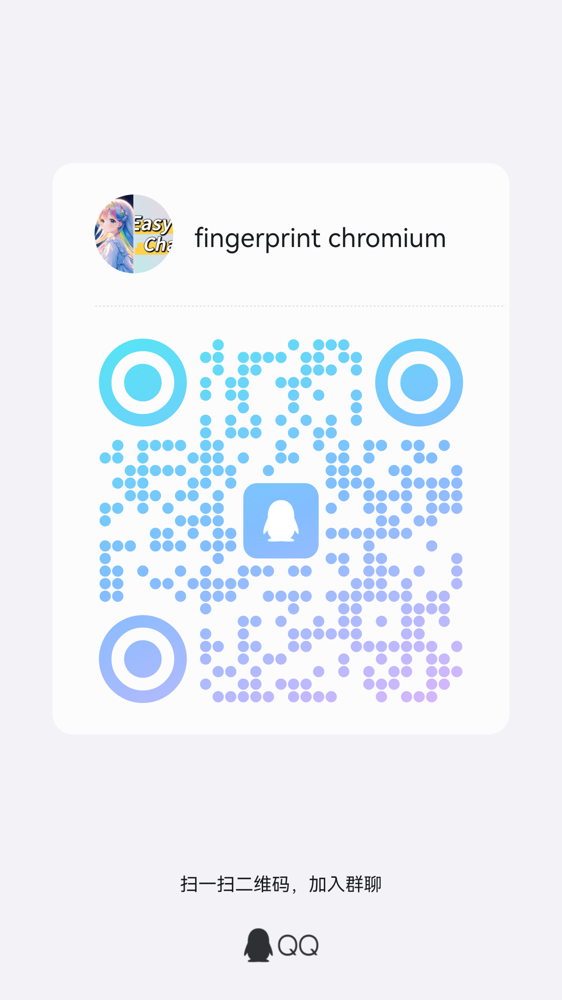

# fingerprint-chromium

[中文文档](README-ZH.md)

*A fingerprint browser based on `Ungoogled Chromium`.*

## Installation and Usage

### Download

Please download the version suitable for your system from the links below. Each major version of Chromium is compiled into a corresponding release. Choose the appropriate version for your operating system:

| **Version**      | **Source Code**                                                                                      | **Windows**                                                                                   | **Linux** | **MacOS**                                                                                   |
|------------------|------------------------------------------------------------------------------------------------------|-----------------------------------------------------------------------------------------------|---------------------------------------------------------------------------------------------|---------------------------------------------------------------------------------------------|
| **Chrome 134** | [134.0.6998.165](https://github.com/adryfish/fingerprint-chromium/tree/134.0.6998.165) | [Installer](https://github.com/adryfish/fingerprint-chromium/releases/download/134.0.6998.165/ungoogled-chromium_134.0.6998.165-1.1_installer_x64.exe) <br> [ZIP](https://github.com/adryfish/fingerprint-chromium/releases/download/134.0.6998.165/ungoogled-chromium_134.0.6998.165-1.1_windows_x64.zip) | [134.0.6998.165-1_linux.tar.xz](https://github.com/adryfish/fingerprint-chromium/releases/download/134.0.6998.165/ungoogled-chromium_134.0.6998.165-1_linux.tar.xz) | |
| **Chrome 133** | [133.0.6943.126](https://github.com/adryfish/fingerprint-chromium/tree/133.0.6943.126) | [Installer](https://github.com/adryfish/fingerprint-chromium/releases/download/133.0.6943.126/ungoogled-chromium_133.0.6943.126-1.1_installer_x64.exe) <br> [ZIP](https://github.com/adryfish/fingerprint-chromium/releases/download/133.0.6943.126/ungoogled-chromium_133.0.6943.126-1.1_windows_x64.zip) | [133.0.6943.126-1_linux.tar.xz](https://github.com/adryfish/fingerprint-chromium/releases/download/133.0.6943.126/ungoogled-chromium_133.0.6943.126-1_linux.tar.xz) |  |
| **Chrome 132**   | [132.0.6834.159](https://github.com/adryfish/fingerprint-chromium/tree/132.0.6834.159)               | [Installer](https://github.com/adryfish/fingerprint-chromium/releases/download/132.0.6834.159/ungoogled-chromium_132.0.6834.159-1.1_installer_x64.exe) <br> [ZIP](https://github.com/adryfish/fingerprint-chromium/releases/download/132.0.6834.159/ungoogled-chromium_132.0.6834.159-1.1_windows_x64.zip) | [ 132.0.6834.159-1_linux.tar.xz ](https://github.com/adryfish/fingerprint-chromium/releases/download/132.0.6834.159/ungoogled-chromium_132.0.6834.159-1_linux.tar.xz) | [132.0.6834.110-1.1_macos.dmg](https://github.com/adryfish/fingerprint-chromium/releases/download/132.0.6834.159/ungoogled-chromium_132.0.6834.110-1.1_macos.dmg) |

---

You can find the compiled versions for each major Chromium release on the GitHub Release page. Download the appropriate file for your platform.

### Build from Source

Refer to the [`ungoogled-chromium`](https://github.com/ungoogled-software/ungoogled-chromium/blob/master/docs/building.md) documentation. Simply replace the `ungoogled-chromium` submodule URL with the `fingerprint-browser` repository URL.

## 📢 Advertisement for Chinese Users

<div style="border: 2px solid #f39c12; padding: 15px; background-color: #fffbe6; border-radius: 10px;">

<b>🌟 EasyChat - Claude Mirror Site</b>

Access Claude's AI services seamlessly:  
- 🆓 **Free to Use**: No registration required, one click to use
- 🌐 **Direct Access**: Optimized for stable China access  
- 👥 **Team Sharing**:  Affordable premium access with shared accounts, no account ban risk

🔗 **Visit now**: [https://easychat.top](https://easychat.top)

</div>

---

## Features

### Fingerprinting Features

| **Fingerprint**                 | **Description**                                                                                          | **Command Line Arguments**                                                      |
|-----------------------------------------|----------------------------------------------------------------------------------------------------------|---------------------------------------------------------------------------------|
| **User-Agent**                          | Modify the browser's `User-Agent`, including `navigator.userAgent`, `navigator.platform`, `navigator.userAgentData`, and `Client Hints` | `--fingerprint-platform` <br>`--fingerprint-platform-version` <br>`--fingerprint-brand` <br>`--fingerprint-brand-version`                  |
| **Audio**                | Obfuscate or spoof audio fingerprint data                                                                | `--fingerprint` (activated when fingerprint seed is enabled)                    |
| **Plugin**               | Modify plugin-related features          | Removed in 133+, browser returns fixed plugin list, spoofing would expose rather than protect   |
| **Hardware**             | Customize hardware parameters such as CPU cores and memory size                                          | `--fingerprint` <br> `--fingerprint-hardware-concurrency`                       |
| **WebGPU Report**             | Modify GPU information including VENDOR and RENDERER (Linux only) | `--fingerprint`(activated when fingerprint seed is enabled)                     |
| **Font**                 | Modify system font information                                                                           | `--fingerprint` (activated when fingerprint seed is enabled)                    |
| **Canvas Image Data Noise**             | Add noise to canvas image data, modifying up to 10 pixels to interfere with fingerprinting               | `--fingerprint`                                      |
| **Canvas MeasureText Noise**            | Scale `Canvas::measureText()` output by a random factor between `-0.0003%` and `0.0003%`, recalculated at each document initialization | `--fingerprint`      |
| **ClientRects Noise**                   | Scale `getClientRects()` and `getBoundingClientRect()` output by a random factor between `-0.0003%` and `0.0003%`, recalculated at each document initialization | `--fingerprint`  |
| **WebRTC Policy**                       | Disable non-proxied UDP connections by default, preventing real IP address leaks via WebRTC              | `--disable-non-proxied-udp` (enabled by default)                                |
| **Language Support**                    | Set the browser language and accepted languages                                                          | `--lang` (set browser language) <br> `--accept-lang` (set accepted languages)   |
| **Timezone Support**                    | Set the browser timezone                                                                                 | `TZ` environment variable (e.g., `TZ=Asia/Shanghai`)                            |

---

### Automation Features

**Optimized for automation scenarios, offering the following features:**

1. **Fake Shadow DOM Support**  
   Adds the `fakeShadowRoot` property, equivalent to the `shadowRoot` property, enabling access to Closed Shadow Root for easier automation handling.

2. **Avoid CDP Detection**  
   Prevents Chrome DevTools Protocol (CDP) detection when invoking `Runtime.enable`, enhancing stealthiness for automation tools.

3. **Webdriver**  
   Sets `navigator.webdriver` to false to avoid detection of automation tools.

4. **Headless**  
   Only changes `User-Agent` from `HeadlessChrome` to `Chrome`. Other headless characteristics remain unchanged, use with caution.

---

### Enabling Fingerprint Features with Command Line Arguments

You can enable or customize fingerprinting and privacy protection features by passing command line arguments when launching the browser:

| **Command Line Argument** | **Description** | **Examples** |
|---------------------------|-----------------|------------------------------|
| **`--fingerprint`** | Specifies the fingerprint seed. When enabled, most fingerprinting features take effect | 32-bit integer |
| **`--fingerprint-platform`** | Specifies the operating system type | `windows`, `linux`, `macos` |
| **`--fingerprint-platform-version`** | Specifies the operating system version | Uses default version if not specified |
| **`--fingerprint-brand`** | Specifies the browser brand in `User-Agent` and `User-Agent Data` | Chrome, Edge, Opera, Vivaldi (default is Chrome) |
| **`--fingerprint-brand-version`** | Specifies the version number for the browser brand | Uses default version if not specified |
| **`--fingerprint-hardware-concurrency`** | Specifies the number of CPU cores | Integer value (randomly generated from fingerprint seed if not provided) |
| **`--disable-non-proxied-udp`** | Specifies WebRTC policy, by default non-proxied UDP connections are disabled | Recommended to keep default setting |
| **`--lang`** | Sets the browser language | Language code (e.g., `en-US`) |
| **`--accept-lang`** | Sets the languages accepted by the browser | Language codes (e.g., `en-US,en`) |

### **New Command Line Arguments for User-Agent Customization**

Chrome 131 introduces two new command line arguments for advanced customization of `User-Agent` and `User-Agent Data`:

- **`--fingerprint-brand`**
  - Specifies the browser brand for `User-Agent` and `User-Agent Data`.
  - Supported values: `Chrome`, `Edge`, `Opera`, `Vivaldi`, or a custom brand name.

- **`--fingerprint-brand-version`**
  - Specifies the version number for the specified brand.
  - Defaults exist for `Chrome`, `Edge`, `Opera`, and `Vivaldi`, but you can provide custom versions.

These arguments enhance browser environment simulation for automation and testing. If `--fingerprint-brand` is omitted, the default brand is used.

## Usage
Here are some command line examples for common use cases:

### Basic Usage (Linux Environment)
```bash
export TZ="America/Los_Angeles" && ./chrome --fingerprint=1000 --user-data-dir=/tmp/chromium/1000
```

### Customizing`User-Agent`

```bash
chrome.exe --fingerprint=2023 --fingerprint-platform=macos --fingerprint-platform-version="15.2.0" --fingerprint-brand="Edge"  --user-data-dir=%TEMP%\chromium
```

## User Communication

Scan the QR code to join the QQ group to communicate with other users:



## Credits

 * [Ungoogled Chromium](https://github.com/ungoogled-software/ungoogled-chromium)

 ## License

BSD-3-clause. See [LICENSE](LICENSE)